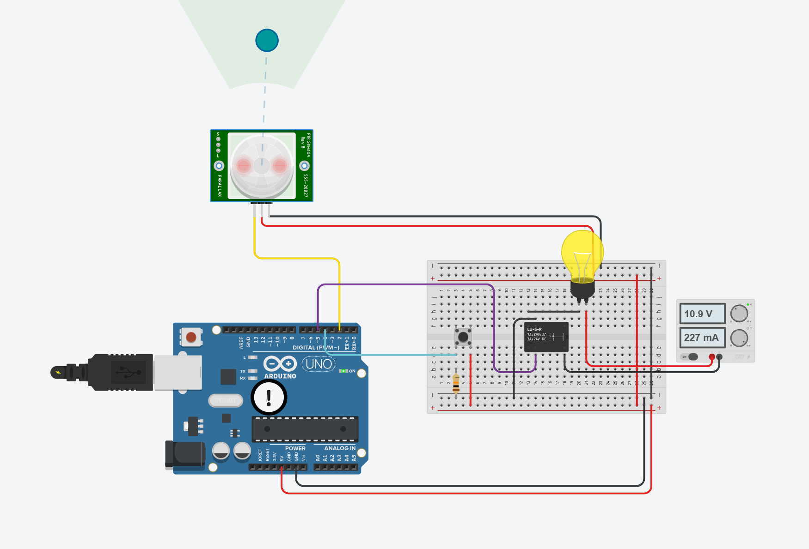
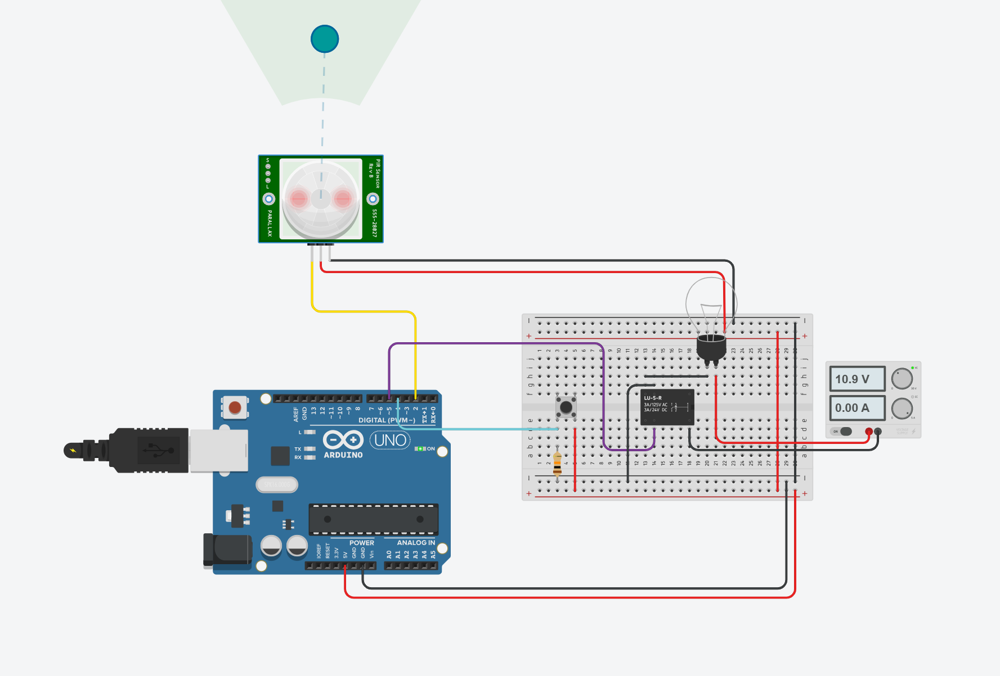
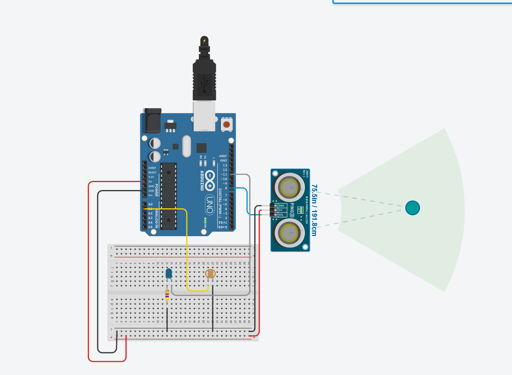
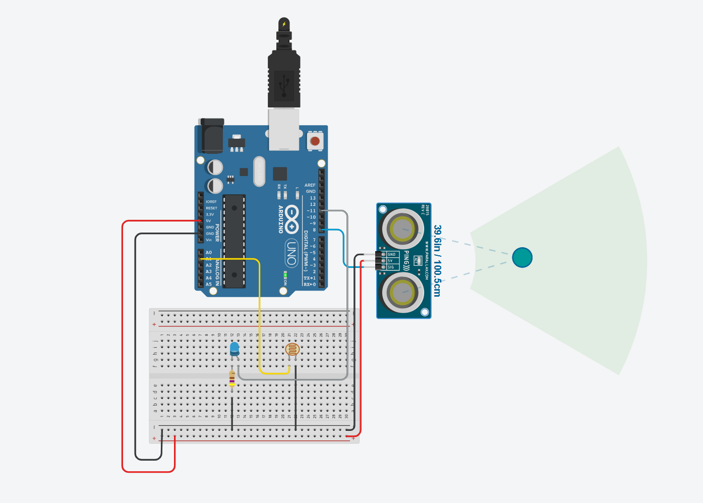
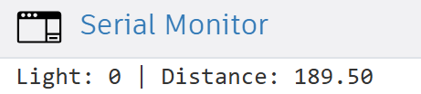

# Arduino Sensor Projects Collection

A collection of two smart Arduino-based sensor systems designed for **energy-saving** and **automated control**. Each project combines hardware components with intuitive logic to create efficient and interactive systems.

---

## Table of Contents

1. [Dual-Control Saver](#dual-control-saver)
2. [Intelligent Proximity Light System](#intelligent-proximity-light-system)

---

## Dual-Control Saver

This project is a smart energy-saving system that uses a **PIR motion sensor** and a **push button** to control a real light bulb using a **relay**. The bulb only turns ON if **motion is detected** *and* **the button is pressed**. When motion stops, the bulb shuts off automatically.

### Features
- Combines motion detection (PIR) and manual input (button)  
- Controls a real AC bulb using a relay module  
- Automatically shuts off the bulb when no motion is detected  
- Ideal for smart energy-saving lighting in controlled environments  
- Safe to use with 220V devices through relay isolation

### Project Preview

<table>
  <tr>
    <th>Button State</th>
    <th>Image</th>
  </tr>
  <tr>
    <td>Pressed</td>
    <td></td>
  </tr>
  <tr>
    <td>Unpressed + Motion</td>
    <td></td>
  </tr>
</table>


### System Logic
 ```cpp
if (motion == LOW) {
  digitalWrite(bulb, LOW);
  return;
}
if (button == HIGH && lastButton == LOW) {
  bulbState = !bulbState;
  digitalWrite(bulb, bulbState);
  delay(200);
}
lastButton = button;
````

### Components Used
- Arduino Uno  
- PIR Motion Sensor  
- Push Button  
- Relay Module (to control real light bulb)  
- Real Light Bulb  
- 10kΩ Resistor  
- Jumper Wires  
- Breadboard  

### Circuit Wiring
- `PIR OUT` → Arduino pin **2**  
- `Button` → Arduino pin **4**  
- `Relay IN` → Arduino pin **5**  
- Bulb connected to relay output terminals  
- GND and 5V connected appropriately  
- 10kΩ pull-down resistor on button

### Try It Yourself
You can try the full simulation here:
[Start Simulation](https://www.tinkercad.com/things/4LO0VkyMW3Q-smooth-turing-vihelmo)

Click "Start Simulation" to watch how the servos sweep back and forth using the Arduino logic.


---


## Intelligent Proximity Light System
A simple and efficient Arduino-based system that uses a Light Dependent Resistor (LDR) and an Ultrasonic Sensor to control an LED. The LED is activated only when ambient light is low and an object is detected within range.

### Features
- Combines analog (LDR) and digital (ultrasonic) sensors
- Automatically activates LED based on real-world conditions
- Ideal for energy-saving smart lighting in dark spaces or corridors

### Project Preview
| LED ON (Dark + Object Detected) | LED OFF (Light or No Object) |
|----------------------------------|-------------------------------|
|  |  |

| Serial Output (Dark) | Serial Output (Light) |
|----------------------|-----------------------|
|  |  |


### System Logic
 ```cpp
if (light < 100 && distance < 100) {
  digitalWrite(ledPin, HIGH);
} else {
  digitalWrite(ledPin, LOW);
}
````
### Components Used
- Arduino Uno
- LDR (Light Dependent Resistor)
- 470Ω Resistor (for LED)
- Ultrasonic Sensor (Ping))) - single SIG pin
- LED
- Breadboard
- Jumper Wires

### Circuit Wiring

- `LDR` → Arduino pin **A1**  
- `LED` → Arduino pin **11**  
- `HC-SR04 SIG` → Arduino pin **8**  
- 470Ω resistor connected to LED  
- LDR connected in voltage divider with **10kΩ** resistor  
- GND and 5V connected appropriately

### Try It Yourself
You can try the full simulation here:
[Start Simulation](https://www.tinkercad.com/things/agbEQ40rsUy-mighty-snicket)

Click "Start Simulation" to watch how the servos sweep back and forth using the Arduino logic.
